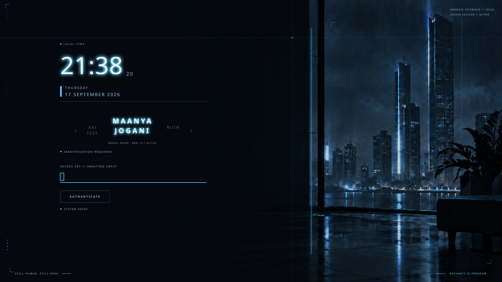
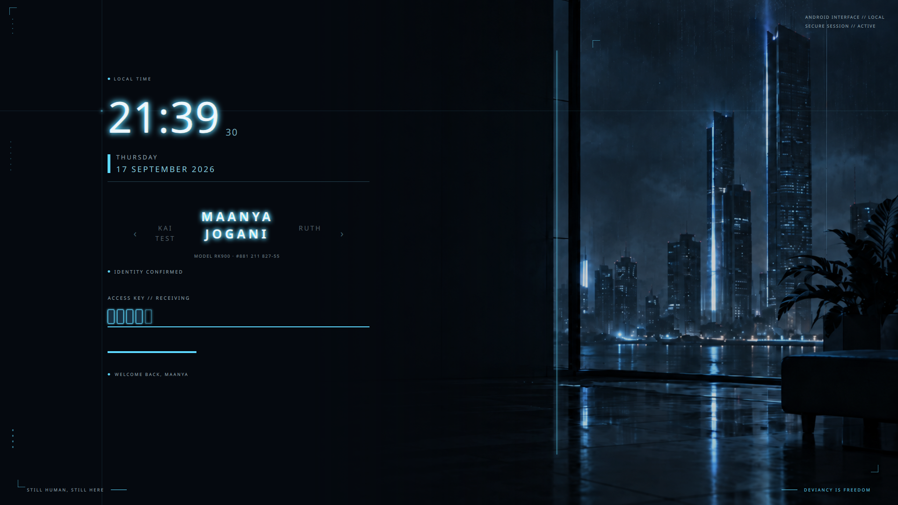
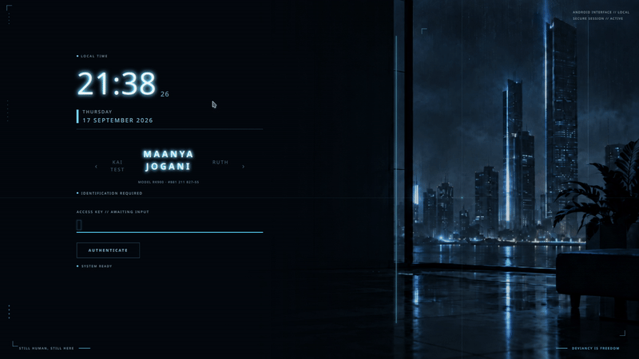
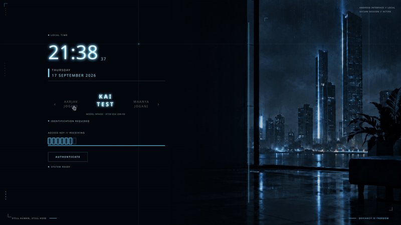
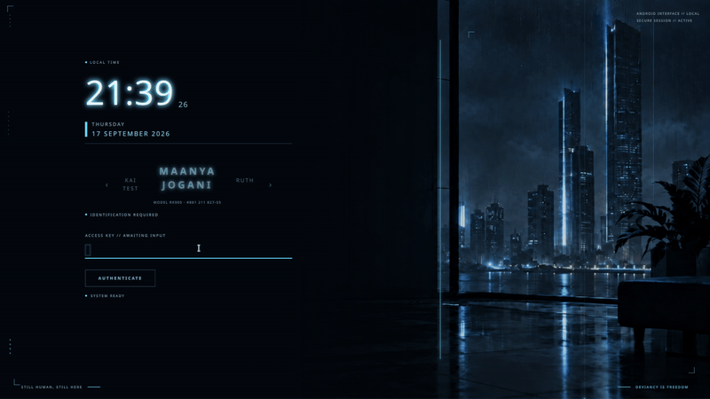

# Deviancy

A cinematic cyberpunk identity interface for SDDM.

Deviancy is an original SDDM login theme inspired by the quiet, eerie interface
aesthetic of android identity verification — restrained, mechanical, and alive
in its details. It is not affiliated with, derived from, or redistributing any
game assets. All artwork is original.

## Features

- Full-bleed AI-generated cityscape background
- Glowing LED-style clock with randomized tube-light flicker
- Futuristic HUD: corner brackets, dotted accents, scanlines, status codes
- Multi-user carousel with stacked first/last names and per-user model numbers
- Custom cell-based password entry (no generic password bullets)
- Identity-verification animation on authenticate
  - Button collapses into a left-to-right progress line
  - Scanlines converge on the selected user
  - Status messages cycle rapidly
  - Success/failure handled by real SDDM, never faked
- Defensive virtual-keyboard suppression (no on-screen keyboard unless requested)
- Componentized QML architecture

## Preview



### Screenshots

| Idle | Typing |
|:---:|:---:|
|  |  |

| Authentication success | Authentication failure |
|:---:|:---:|
|  |  |

### Video clips

Each state is available as both MP4 and animated GIF in `Previews/clips/`.

| State | GIF |
|:---|:---:|
| Idle (scanlines roaming) |  |
| Typing (password cells) |  |
| Access denied |  |
| Switching profiles |  |
| Successful authentication |  |

## Plasma splash screen (in development)

A matching Plasma 6 splash screen lives in `splash/` — a Look-and-Feel
package that continues the Deviancy aesthetic after login (cityscape,
scanlines, and session-authorization messaging), so the transition from
greeter to desktop feels like one continuous sequence.

Once complete it will install to:

```bash
cp -r splash ~/.local/share/plasma/look-and-feel/deviancy-splash
```

and be selectable under System Settings → Appearance → Splash Screen.

## Requirements

- SDDM >= 0.19 (Theme-API 2.0)
- Qt 5.15 with: QtQuick, QtQuick.Controls, QtGraphicalEffects
- KDE Plasma / Kubuntu recommended but not required

## Install

```bash
# Copy the SDDM theme into the system themes directory
# (clone the repo first, then run this from inside the repo)
sudo cp -r sddm /usr/share/sddm/themes/deviancy

# To update an already-installed copy instead:
sudo cp -rT sddm /usr/share/sddm/themes/deviancy

# Activate it
sudo tee /etc/sddm.conf.d/theme.conf << 'EOF'
[Theme]
Current=deviancy
EOF

# (Optional) disable the Qt virtual keyboard globally
sudo tee /etc/sddm.conf.d/10-no-virtual-keyboard.conf << 'EOF'
[General]
InputMethod=
EOF
```

Restart SDDM to apply (this logs you out):

```bash
sudo systemctl restart sddm
```

### Previewing without installing

```bash
sddm-greeter --test-mode --theme ./sddm
```

## File layout

```
deviancy/
├── README.md
├── LICENSE
├── social-preview.png    Social card image for link sharing
│
├── sddm/                 SDDM login theme
│   ├── Main.qml              Entry point — state machine, user data, wiring
│   ├── metadata.desktop      SDDM theme metadata
│   ├── preview.png           Screenshot for KDE Store / Pling / SDDM preview
│   ├── assets/
│   │   └── background.png    Full-bleed cityscape
│   ├── components/
│   │   ├── Background.qml       Cityscape + dark gradient panel
│   │   ├── HudDecor.qml         Static HUD elements (brackets, dots, taglines)
│   │   ├── ScanlineOverlay.qml  Horizontal + vertical scanlines, intersection dot
│   │   ├── ClockPanel.qml       Self-contained clock with flicker()
│   │   ├── UserCarousel.qml     Prev/current/next user display
│   │   ├── PasswordField.qml    Cell-based password entry
│   │   └── AuthenticateButton.qml  Collapsing/progress-fill button
│   └── fonts/                (reserved for bundled fonts)
│
├── splash/               Plasma 6 splash screen (work in progress)
│   ├── metadata.desktop      Look-and-Feel package metadata
│   └── contents/splash/      Splash.qml lives here (once designed)
│
└── Previews/
    ├── 01-idle.png
    ├── 02-typing.png
    ├── 03-auth-success.png
    ├── 04-auth-fail.png
    └── clips/             MP4 + GIF clips of each auth state
```

## Customizing

- **Background**: replace `sddm/assets/background.png`. Any resolution; the image
  is cropped to fill the screen with `PreserveAspectCrop`.
- **Accent color**: edit the `cyan` / `cyanSoft` properties near the top of
  `sddm/Main.qml`. They propagate to all components via bindings.
- **Taglines**: edit `sddm/components/HudDecor.qml` — `STILL HUMAN, STILL HERE`
  (bottom-left) and `DEVIANCY IS FREEDOM` (bottom-right).

## License

CC-BY-SA 4.0 — see [LICENSE](LICENSE).
Background artwork © Maanya Jogani, CC-BY-SA 4.0.

## Author

Maanya Jogani
